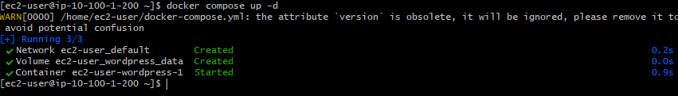
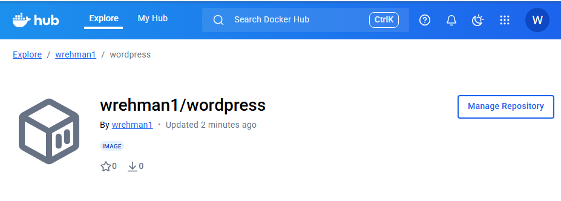
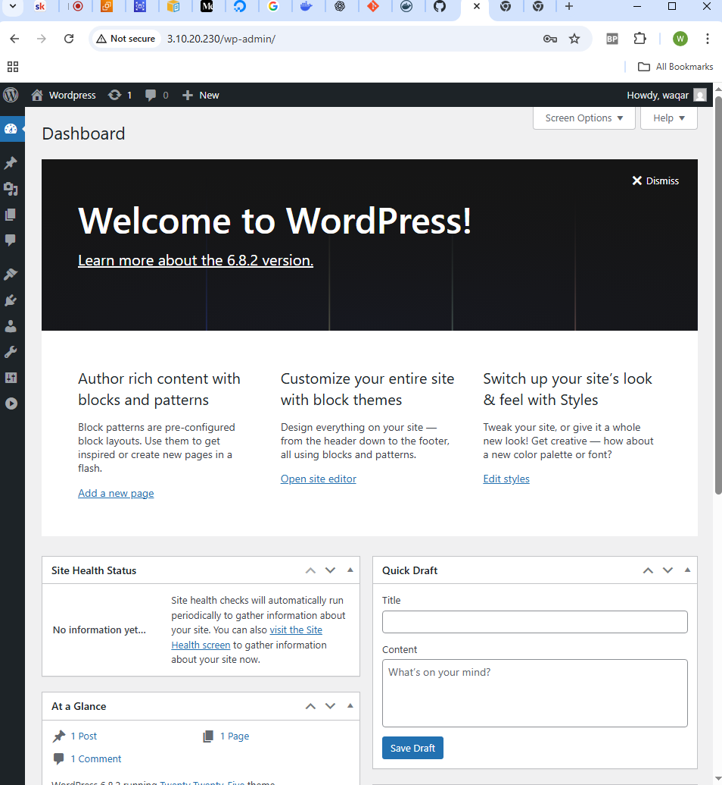

# Deploying Wordpress on AWS with RDS using Terraform, and Docker

I will be deploying a WordPress application on AWS EC2 (Elastic Compute Cloud) with RDS (Relational Database Service) using Terraform to automate on AWS and Docker. 

## Description

I chose to complete this project as it would help cement my knowledge on what I learnt on Terraform. It has allowed me to visualise how envornments are automated using just the .tf files and how everthing is seamlessly teared down using terraform destroy command. This projected has increased my knowledge on how all the tools work together to acheive a common goal from start to finish. 

For this assignment: 

1. I will create a Terraform script to deploy a Virtual Machine (VM) in a public subnet and deploy the RDS in a private subnet.

2. I will Create a Dockerfile to deploy Wordpress with Apche Webserver and PHP in the same VM.

3. I will Build the Docker image, tag it, and push it to Docker Hub.

4. Lastly, I will connect Wordpress container with RDS database.

## Getting Started

### Prerequisites

• AWS account
• IAM credentials set via environment variables
• Key pair created in AWS EC2
• Terraform installed locally
• DockerHub Logins

### Why EC2?

EC2 (Elastic Compute Cloud) is one of AWS services where we can run web applications, host databases, and more. Here, we are running Wordpress application on EC2.

### Why Wordpress?

Wordpress is tool to publish blogs and websites. It is a free and open-source web CMS (content management system) written in PHP and paired with MySQL database. Here, I am using WordPress as an example.

### Why RDS?

RDS (Relational Database Service) is also one AWS services. It is a managed database service that simplifies the process of setting up, operating, and scaling a relational database in the cloud. Since WordPress require database to stores data on a backend, so we are using AWS RDS.

### Why Terraform?
Terraform is an free and open-source Infrastructure as Code (IaC) tool developed by HashiCorp company. With Terraform, we can define, provision, and manage our infrastructure resources across various cloud providers, as well as on-premises environments, in a declarative manner. Here, we are provisioning AWS cloud infrastructure.

### Why Docker?

Docker is an free and open-source containerization platform used for developing, deploying, and managing applications in lightweight containers. It is a smallest and standardised unit and it is a simple text file which contains all the steps to build the container. Here, we will be deploying a WordPress application using Docker.

